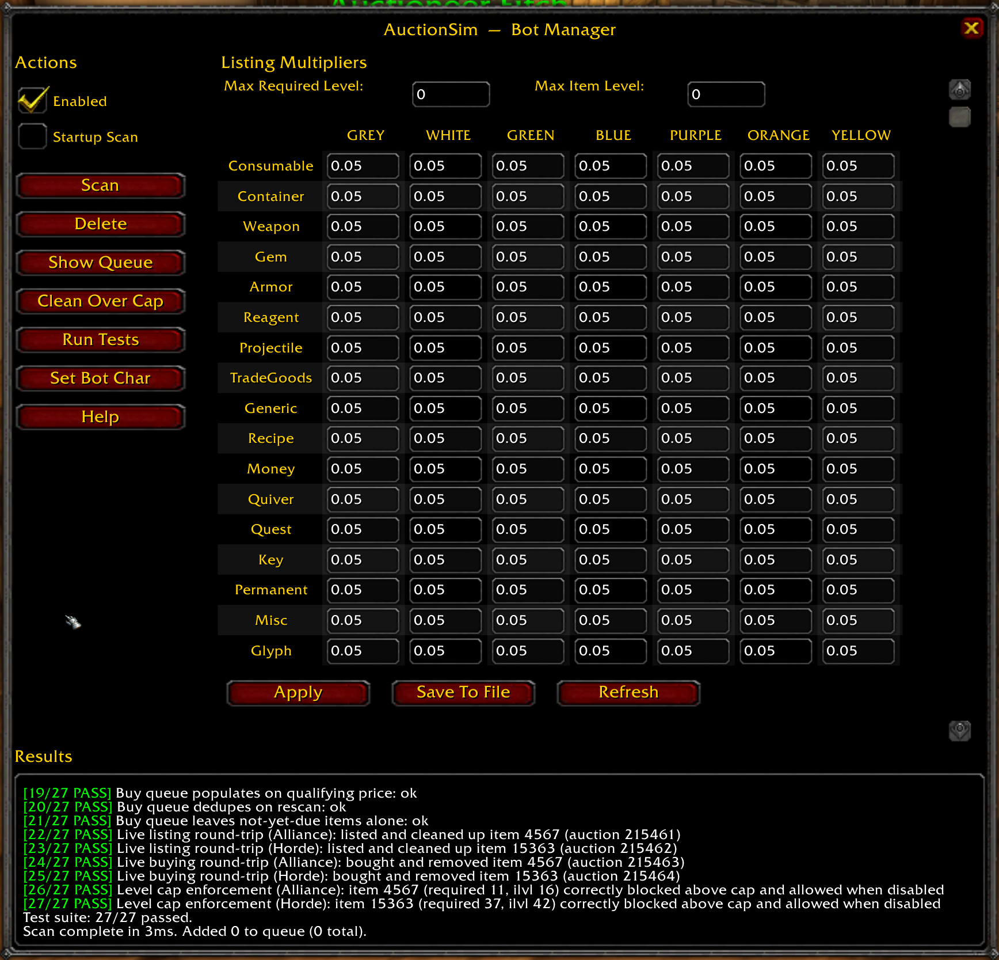

# AuctionSim: A Module For AzerothCore WoTLK 3.3.5a

AuctionSim populates and maintains your realm's auction house using price data scraped from a live WoW 3.3.5a economy (Lordaeron, Warmane). Unlike the classic ah-bot module, it isn't limited to a handful of item categories and doesn't price items based on their vendor sell price. It uses real observed mean/min/max prices, with separate price tables for Alliance and Horde (no neutral AH support). Listing behavior is fully configurable per item class and quality. Unlike other auction managers, tt runs very fast and can manage very large auction houses with no lag during scans.

## How it works

Every hour (fixed, not configurable), AuctionSim scans both auction houses:

- **Listing**: for each item class/quality bucket, it lists new items up to the percentage targets set in the config, picking a random quantity and a buyout price rolled around the item's known mean price.
- **Buying**: for each auction it doesn't already own, if the price is at or under the item's known mean, it's always queued to buy. If the price is above mean but still under the item's known maximum, it's queued with some probability (randomized each scan, to mimic natural demand variance between real players) rather than always or never. Queued purchases execute within 45 minutes of being queued.
- Optional `MaxRequiredLevel`/`MaxItemLevel` caps stop it from listing gear above your realm's level, for progression servers running below the max level.

## Installation

1. From your AzerothCore `modules` directory:
   ```
   git clone https://github.com/Moloch17/mod-auctionsim.git
   ```
2. Rebuild AzerothCore.

**Notes:**
- If you've previously used ah-bot or ah-bot-plus, there's no conflict, but the two cannot run at the same time -- disable other auction house bot modules before enabling this one.
- Not intended for use with combined auction house enabled.
- AuctionSim is disabled by default.

## Configuring the Module Using the Companion Addon

This module can be fully configured using a companion interface addon. Copy the ahsim folder in interface_addon into your game's Interface/Addons directory. Once logged in with an account that has GM privileges, run /auctionsim or /ahsim to open the configuration UI. Click the help button for step by step instructions for configuring the module. The same help text in the help menu is reproduced below:

```
AuctionSim - First-Time Setup
=============================

AuctionSim runs a bot character that lists and buys items on the Auction House 
so a low-population realm still has a busy AH.

Everything in this window is saved to auctionsim.conf. You do not need to edit
that file by hand.


1. Requirements
---------------
- A character for the bot to use. A dedicated character on its own account is
  best, but any character works - including the one you are logged in on right
  now.
- Two-side auction interaction must be OFF in worldserver.conf:
      AllowTwoSide.Interaction.Auction = 0
  The module refuses to start otherwise.
- You must be a GM to open this window (/auctionsim or /ahsim).


2. Point the module at the bot character
----------------------------------------
- Click "Set Bot Char".
- Type the character's name and click Okay.
- The server looks the character up, writes its character id and account id to
  auctionsim.conf, and - if the module is already enabled - switches the running
  bot to it right away. No restart needed.
- Success, or the reason it failed, shows in the Results box.


3. Enable the module
--------------------
- Tick "Enabled". It saves immediately and starts the bot.
- Optionally tick "Startup Scan" to run a scan automatically on every server
  start.


4. Choose what the bot lists
----------------------------
In the "Listing Settings" grid on the right:

- Max Required Level / Max Item Level: the bot skips items above these. 0 means
  no limit.
- The grid is the percentage of scanned items in each category and quality that
  the bot will list. Enter a plain number: 50 means 50%. Over 100 lets it list
  duplicates. 0 disables that cell.
- When editing a cell you must press enter to apply the change.
- Click "Apply" to send your changes, then "Save To File" to write them to
  auctionsim.conf.
- "Refresh" reloads the values from the server and discards unsaved edits.

5. First run
------------
- Click "Scan". The bot lists new auctions and queues items to buy. Queued buys
  are spread over time, not done all at once.
- Note: Searching the auction house after running a scan while logged in as the
  bot character can take a little while for the auction db to update if there are
  a lot of new auctions.
- After that the module scans on its own on a timer.


Button reference
----------------
Scan            List new auctions and queue buys now.
Delete          Remove every auction the bot currently has listed.
Show Queue      Show the buy queue size and when the next and last buy are due.
Clean Over Cap  Remove bot auctions that are now above the level caps.
Run Tests       Run the module's built-in self-tests; output goes to Results.
Set Bot Char    Choose which character the bot uses (see step 2).
Help            This window.


Notes
-----
- Mail the bot would get from its own auctions is discarded automatically.
- Everything set here is written to auctionsim.conf, so it survives a restart.
```

