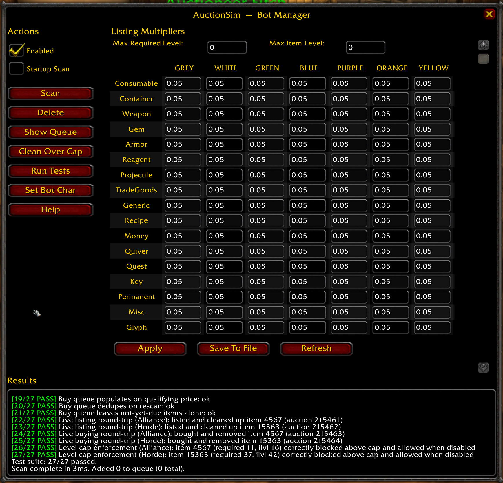

# AuctionSim: A Module For AzerothCore WoTLK 3.3.5a

AuctionSim populates and maintains your realm's auction house using price data scraped from a live WoW 3.3.5a economy (Lordaeron, Warmane). Unlike the classic ah-bot module, it isn't limited to a handful of item categories and doesn't price items based on their vendor sell price. It uses real observed mean/min/max prices, with separate price tables for Alliance and Horde (no neutral AH support). Listing behavior is fully configurable per item class and quality. Unlike other auction managers, it runs very fast and can manage very large auction houses with no lag during scans.

## How it works

Every 30 minutes (fixed, not configurable), AuctionSim scans both auction houses:

- **Listing**: it keeps each item class/quality bucket about as full as a real auction house was observed to be in the scan data -- topping a bucket up only once it drops below the observed lower quartile, and choosing which items fill it weighted by how often each was really listed. A per-bucket multiplier in the config scales that target up or down. New listings get a random quantity, a buyout price rolled around the item's known mean price, and a lower starting bid rolled from the starting-bid-to-buyout ratios seen in the real scan data.
- **Buying**: for each auction it doesn't already own, if the price is at or under the item's known mean, it's always queued to buy. If the price is above mean but still under the item's known maximum, it's queued with some probability (randomized each scan, to mimic natural demand variance between real players) rather than always or never.
- **Bidding**: it bids like one more player. On an auction a real player is bidding on it may outbid them, and on a player's auction nobody has bid on it may open the bidding when the starting bid is a clear bargain. Each auction gets its own limit, rolled once between the item's lower-quartile and market price, so the bot wins some bid wars and walks away from others. It never bids at or above the cheapest buyout of the same item on the auction house, the auction's own buyout, or the vendor price. Bids are the game's minimum increment, often rounded up to a clean amount the way a player types it. It never bids in an auction's last 30 minutes, so a player it outbids always has time to answer, and it never removes an auction someone has bid on, so the bidder's gold is never stranded.
- Queued buys and bids execute within 20 minutes of being queued, spread out over time. "Run Queue" in the addon (or `.auctionsim runqueue`) forces them all through immediately.
- Optional `MaxRequiredLevel`/`MaxItemLevel` caps stop it from listing gear above your realm's level, for progression servers running below the max level.

## Experimental features

Market mode (below) and Replay bidding are experimental: they work, but their behaviour may still change between releases. The companion addon groups them on its **EXPERIMENTAL FEATURES** tab.

- `AuctionSim.Replay.Bidding` (default `1`): `0` stops the Replay bot bidding -- no opening bids, no outbids, and bids already queued are dropped; buyouts are unaffected. Applies from the next scan when changed in the addon, or after a config reload (Set Bot Char, `.auctionsim market reload`).
- Ticking Market Mode in the addon offers to restart the worldserver at once (the stock 10-second restart, exit code 2). The server only comes back by itself if the host restarts the process: a Docker restart policy, a service manager or the restarter script.

## Market mode

`AuctionSim.Mode = Market` (default `Replay`, the behaviour above) runs a different market, learned from Lordaeron's scans and shipped as `data/auctionsim_market.dat` (format: `ml/MARKET_FORMAT.md`; produced by `ml/s6_export.py`):

- **Named sellers.** Each faction gets `AuctionSim.Market.Bots` (default 100) seller bots whose names show as the seller in the AH. Their names come from the data file; names already taken on the realm are skipped. The module creates their characters on first start: real character rows on accounts `AHSIMMKTA01`, `AHSIMMKTA02`, ... (Alliance races) and `AHSIMMKTH01`, ... (Horde races), ten characters per account, each account with a random password nobody is told (a login on a seller is kicked anyway). They never log in, survive restarts, and their names can't be taken by players.
- **Posts.** Every 30 minutes each seller's basket posts per the learned rates, stacks and prices: priced against the cheapest listing of the item already up (any owner, players included), never under the vendor price or, for crafted goods, the reagents' cost. Durations, deposits and expiry are the core's.
- **Buyers.** Buyers arrive per item at learned rates (with a weekday pattern), each with a reservation price, and buy the cheapest listing at or under it -- whoever owns it, so players sell to the market by listing at a fair price. Purchases go through the bot character (`BotCharacterID`) and its queue, spread over 20 minutes. A player's listing of a vendor-stocked item is never bought above the vendor price.
- **Gold.** The only gold that enters the economy is the price the buyer bot pays for a *player's* listing (the core's normal sale mail, minus its cut). The buyer itself is never debited. Everything paid to a seller bot -- sale proceeds, returned deposits, expired items -- is discarded, so gold players spend on bot listings leaves the economy. Only the auction house's mail is discarded: mail a player or GM sends to a bot character is delivered as usual and goes back to its sender when it expires. Seller bots hold no gold; their deposits are computed as the core would and recorded on the auction, not debited.
- `AuctionSim.Market.Scale` (default 0.1) sizes the market as a fraction of Lordaeron's (~60k auctions per faction at 1). It doesn't depend on the realm's population.
- `.auctionsim market fill [alliance|horde]` populates a house at once (MARKET_FORMAT.md's Fill): it simulates the 48 hours before now on virtual seller listings, with the real house as competitors that are never bought, and takes the survivors as the house's steady state: it adds at most that total minus what the sellers already have up (an item's excess over the sellers' own listings of it, items in random order), so a fill on an empty house adds a full house and one on a full house almost nothing. Each is created with its remaining time through the same 100-per-tick creation queue. The simulation itself is spread over ticks (at most ~4 ms each).
- `.auctionsim market purge` reports what it would delete; `.auctionsim market purge confirm` deletes the module's seller accounts (`AHSIMMKTA..`/`AHSIMMKTH..`) and their characters through the core's `AccountMgr::DeleteAccount`, after removing every seller auction (a bidder gets the bid back by the core's cancel mail). It refuses entirely if a seller account holds a character the module didn't create (levelled, played, wrong race/class/faction, online, GM access, or the buyer bot), and never touches the buyer bot. The market then stops until restart or `.auctionsim market reload`; with `Mode = Market` that restart creates the sellers again, so set `Mode = Replay` (or disable the module) first to remove the footprint.
- `.auctionsim market status` shows the sellers in use, the last step's numbers and the work still queued; `.auctionsim market reload` re-reads `auctionsim.conf` and the data file. Without a current `auctionsim_market.dat` the module refuses to run in Market mode and tells GMs at login.
- Cost: one pass over each house per 30 minutes; at Scale 0.1 a step's arithmetic takes about 0.5 ms per house, and auctions are created at most 100 per world tick.

## Installation

1. From your AzerothCore `modules` directory:
   ```
   git clone https://github.com/Moloch17/mod-auctionsim.git
   ```
2. Rebuild AzerothCore.
3. Copy `interface_addon/ahsim` into your game's `Interface/AddOns` directory (see below). The module and addon ship as a pair: after updating one, update the other too, or a GM gets a version-mismatch notice.

**Notes:**
- If you've previously used ah-bot or ah-bot-plus, there's no conflict, but the two cannot run at the same time -- disable other auction house bot modules before enabling this one.
- Not intended for use with combined auction house enabled.
- AuctionSim is disabled by default.

## Configuring the Module Using the Companion Addon

This module can be fully configured using a companion interface addon. Copy the ahsim folder in interface_addon into your game's Interface/Addons directory. Once logged in with an account that has GM privileges, run /auctionsim or /ahsim to open the configuration UI. Click the help button for step by step instructions for configuring the module. The same help text in the help menu is reproduced below:

```
AuctionSim - First-Time Setup
=============================

AuctionSim runs a bot character that lists and buys items on the Auction House 
so a low-population realm still has a busy AH.

Everything in this window is saved to auctionsim.conf. You do not need to edit
that file by hand.


1. Requirements
---------------
- A character for the bot to use. A dedicated character on its own account is
  best, but any character works - including the one you are logged in on right
  now.
- Two-side auction interaction must be OFF in worldserver.conf:
      AllowTwoSide.Interaction.Auction = 0
  The module refuses to start otherwise.
- You must be a GM to open this window (/auctionsim or /ahsim).


2. Point the module at the bot character
----------------------------------------
- Click "Set Bot Char".
- Type the character's name and click Okay.
- The server looks the character up, writes its character id and account id to
  auctionsim.conf, and - if the module is already enabled - switches the running
  bot to it right away. No restart needed.
- Success, or the reason it failed, shows in the Results box.


3. Enable the module
--------------------
- Tick "Enabled". It saves immediately and starts the bot.
- Optionally tick "Startup Scan" to run a scan automatically on every server
  start.


4. Choose what the bot lists
----------------------------
In the "Listing Multipliers" grid on the right:

- Max Required Level / Max Item Level: the bot skips items above these. 0 means
  no limit.
- The bot works out how full to keep each category and quality from real auction
  scan data. Each grid cell scales that target: 1 matches the real market, 1.5
  keeps it 50% fuller, 0.5 half as full, 0 disables that cell. Enter a plain
  number like 1, 1.5 or 0.25.
- The scan data was taken from a realm with a saturated auction house, so the
  default values are scaled down.
- When editing a cell you must press enter to apply the change.
- Click "Apply" to send your changes, then "Save To File" to write them to
  auctionsim.conf.
- "Refresh" reloads the values from the server and discards unsaved edits.

5. First run
------------
- Click "Scan". The bot lists new auctions (each with a buyout and a lower
  starting bid) and queues actions: items to buy outright, plus bids on players'
  auctions it values (never in an auction's last 30 minutes). Queued actions are spread over
  time, not done all at once - click "Run Queue" to force them all through now.
- Note: Searching the auction house after running a scan while logged in as the
  bot character can take a little while for the auction db to update if there are
  a lot of new auctions.
- After that the module scans on its own on a timer.


6. EXPERIMENTAL FEATURES tab
----------------------------
The second tab at the top of the window holds the features that work but may
still change between releases: Market mode, its settings and commands, and
Replay bidding.

Replay Bidding (default on): whether the Replay bot bids. On, it outbids
players and opens bidding on players' auctions as described above. Off, it
never bids: no new bids, and bids already queued are dropped. Buyouts are
unaffected. Takes effect from the next scan (AuctionSim.Replay.Bidding).

"Market Mode" switches the module from replaying scanned prices to a market
learned from Warmane - Lordaeron (auctionsim_market.dat). The change is saved at
once but only takes effect when the worldserver restarts. Ticking it asks
"Restart the worldserver now to apply the change?":
- Yes restarts the server the stock way (a 10 second countdown players see,
  like ".server restart 10"). The server only comes back by itself if the host
  restarts the process - a Docker restart policy, a service manager or the
  restarter script. Refused if a shutdown is already pending.
- No leaves it for your next restart.
Unticking it (back to Replay) is saved the same way and also needs a restart.

In Market mode:
- Named seller bots post the auctions; their names show as the seller in the
  AH. The module creates their characters itself on first start, on accounts
  AHSIMMKTA01.. (Alliance) and AHSIMMKTH01.. (Horde) that nobody can log into.
  Names already taken on your realm are skipped.
- Buyers buy the cheapest listing they find worth it - players' listings too,
  which is how players sell to the market. The buys still go through the bot
  character from step 2 and the queue.
- Market Bots: sellers per faction (default 100). Applies at restart or with
  "Market Reload".
- Market Scale: market size as a fraction of Lordaeron's (default 0.1, about
  6000 auctions per faction). Applies from the next step. Your realm's
  population doesn't matter.
- "Scan" on the main tab runs one market step.
- If auctionsim_market.dat is missing or out of date the module refuses to run
  and tells GMs at login; untick Market Mode to go back to Replay.

Market commands on the tab:
Market Status   Sellers in use, the last step's numbers, fill progress and
                what is still waiting to post (".auctionsim market status").
Market Fill     Fills the house at once, as if the sellers had been running for
                the last 48 hours (".auctionsim market fill [alliance|horde]").
                Auctions appear at up to 100 per server tick.
Market Reload   Re-reads auctionsim.conf and auctionsim_market.dat and
                re-resolves the sellers (".auctionsim market reload").
Market Purge    Deletes the seller accounts, characters and auctions the module
                created (".auctionsim market purge"). It first shows what it
                would delete, then asks again. Bidders on a seller auction get
                their gold back by mail. The market stops until a restart; with
                Market Mode still on, the restart creates the sellers again, so
                untick Market Mode first if you want them gone for good.

Button reference
----------------
Scan            List new auctions and queue buys and bids now (Market mode: run
                one market step).
Delete          Remove every bot auction nobody has bid on, market sellers'
                included (bid-on ones are left to expire so the bidder's gold
                isn't stranded).
Show Queue      Show the queue size and when the next and last action are due.
Run Queue       Execute every queued buy and bid right now.
Clean Over Cap  Remove bot auctions now above the level caps (again skipping
                any that have a bid).
Run Tests       Run the module's built-in self-tests; output goes to Results.
Set Bot Char    Choose which character the bot uses (see step 2).
Help            This window.


Version notices
--------------
After a module update the Results box (and a GM's chat at login) may show:
- "auctionsim.conf is out of date" - your config is missing keys the new module
  version added. A current auctionsim.conf.dist is kept in etc/modules/; copy the
  new keys into your auctionsim.conf. The module keeps running on defaults for the
  missing keys until you do; it never edits auctionsim.conf itself.
- "auctionsim.dat is out of date" - the data file's format changed. Pull the
  latest changes and rebuild the module; the current auctionsim.dat ships with the
  repo and is redeployed on build (you do not need the raw scans or
  data/compile-data). The module has no market data until then.
- "auctionsim_market.dat can't be used" - Market mode is on but its data file is
  missing or from another format version. Rebuild the module to redeploy it, or
  switch back to Replay.
- "addon / module version mismatch" - the AHSim addon and the server module ship
  as a pair; update whichever the message says is older.
Each notice shows once per version, so a fixed problem stops repeating.


Notes
-----
- Auction-house mail to the bot (and every market seller) is discarded
  automatically. Other mail to them (from a player or a GM) is delivered as
  usual and returns to its sender when it expires.
- Everything set here is written to auctionsim.conf, so it survives a restart.
```

